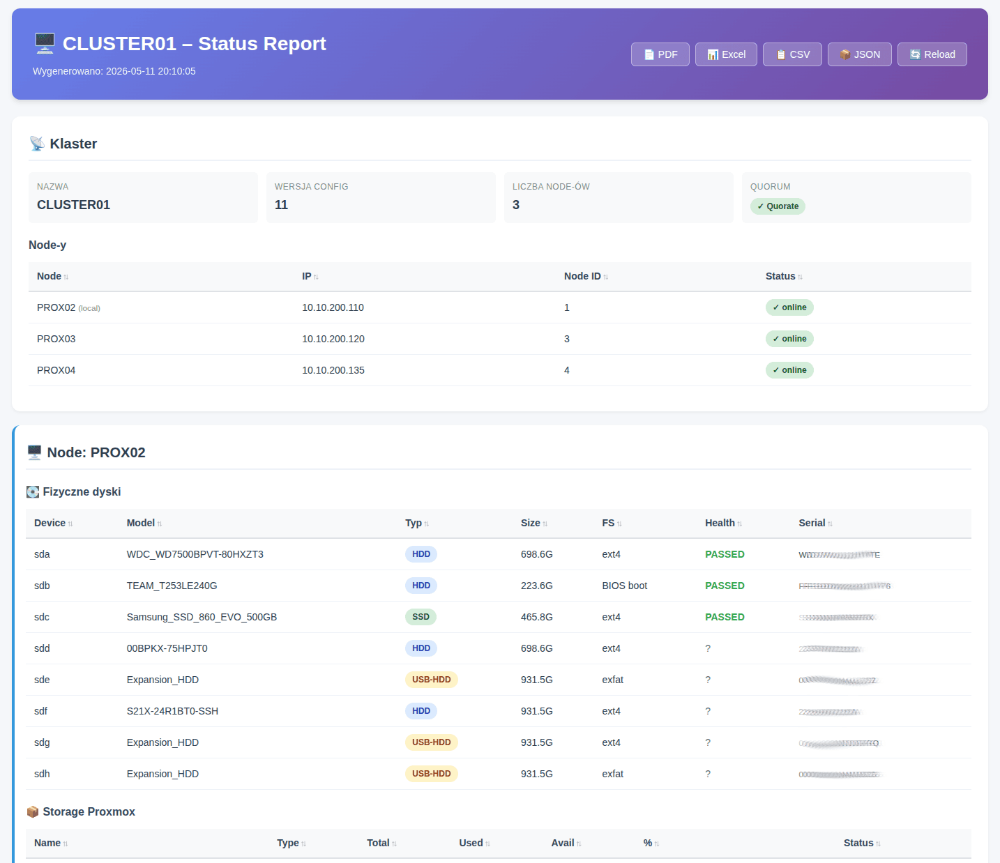

## Screenshots

### HTML Dashboard


## proxmox-tools

Narzędzia administracyjne klastra Proxmox CLUSTER01.

## Skrypty

- `cluster-status.sh` — pełny status klastra (node'y, dyski, VM-ki, LXC)

## Użycie

Klonowanie na nodzie Proxmox:
```bash
